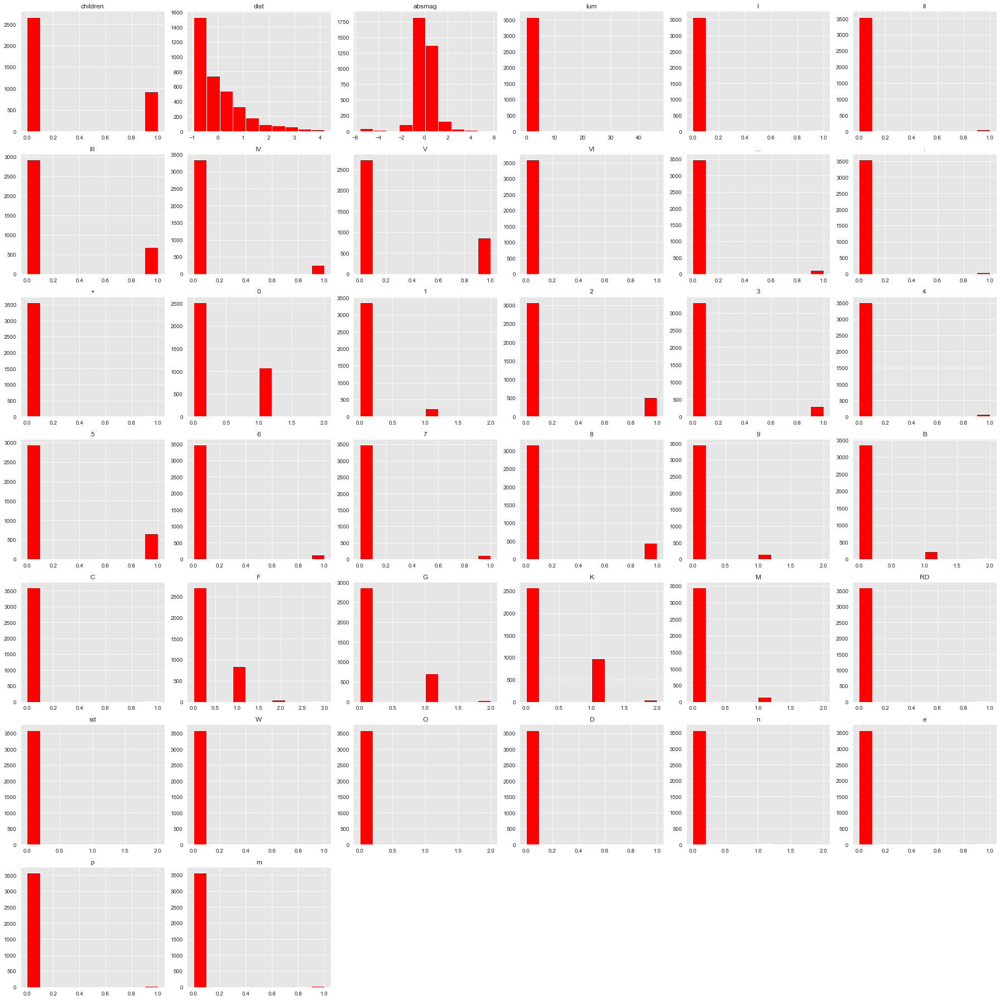
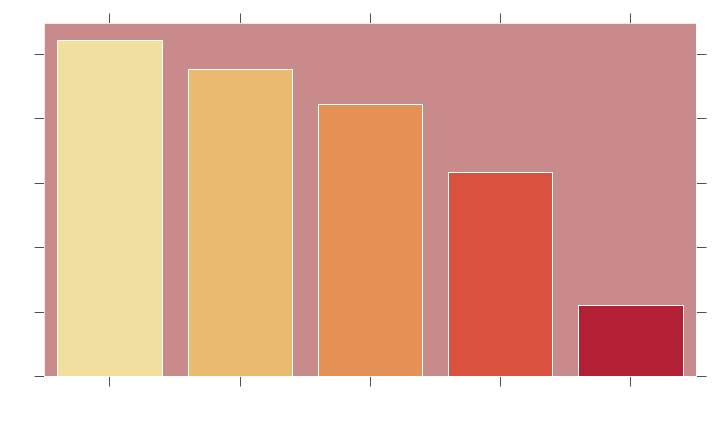
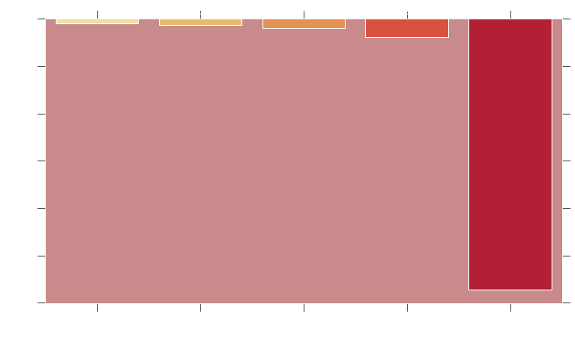

# Predicting Exoplanets With Logistic Regression
<br>  </br>
Course: Part-Time Data Science <br>
<br> Instructor: Amber Yandow </br> 
<br>- Author: [Fennec C. Nightingale](mailto:fenneccharles@gmail.com) 
# Overview: 
Predict & map wether or into a stay is likely to have an exoplanet & make recommendations for astronomers to speed up the rate of exoplanet discovery Focus on recall so we're unlikely to inccoretly miss any planets. 

# The Data:
CSV & XML tree Data on stars, their planets, their parent systems & their physical characteristics.<br> <br>
- Our expolanet data is from the <a href="https://github.com/OpenExoplanetCatalogue/open_exoplanet_catalogue"> Open Exoplanet Archive/Catalog </a> & includes: Star names, magnitudes, radii, distance, right asciension/declination, spectral class</br> <br>
- Our additional star data is from the <a href="https://github.com/astronexus/HYG-Database"> HYG dataset </a> & includes: Id numbers, names, magnitudes, luminosity, x, y, z coordinates for the stars, spectral class, and some details about each stars orbit</br>  <br>

# The Process:
I used Python in Jupyter Notebook to perform <a href="https://machinelearningmastery.com/how-to-work-through-a-problem-like-a-data-scientist/"> OSEMN </a> & <a href="https://en.wikipedia.org/wiki/Logistic_regression#:~:text=Logistic%20regression%20is%20a%20statistical,a%20form%20of%20binary%20regression)."> Logistic </a> regression to create our model and predictions for housing prices in King County. 

# O - Obtain 
We obtained our stars data here from the links above over at Kaggle. If you want to get started on your own classification project like this, <a href="https://github.com/learn-co-curriculum/dsc-phase-3-project"> fork this repo.</a><br>

# S- Scrub 
After importing all of our data we checked it for null values, outliers, duplicates, and any other errors there might be in our dataset. We checked each column and decided what data we needed to keep or discard, what we might need to fill, or any other alterations we could make to fix up our data before we start modeling. This turned out to get rid of too much of our initial dataset on exoplanets alone, so I also lined up the ID numbers with the HYG dataset so I could randomly sample stars we have not found planets around. 

# E - Explore 
 <br>
We check out our data to see how our values are distributed, if there is any strong correlation, or if theres anything we missed in our scrubbing. Some of the catagories we wanted to include had really high correlations, but our cut off was .6 & there was no way to fix the multicolinearity through strategies like multiplication, so those catagories were dropped.</br>

# M - Model 
We use the<a href="https://scikit-learn.org/stable/modules/generated/sklearn.linear_model.LogisticRegression.html"> Sklearn Logistic regression module</a> to get our best fit in this project.<br> To work with some of our data in this model, we also have<a href="https://stattrek.com/multiple-regression/dummy-variables.aspx"> to get dummies for</a> our catagorical variables. After doing an initial model including all of our variables we used a GricSearchCV to go back through and refine our model, trying to make our predictions stronger. After modeling, we check all available evaluation metrics & compare. <br>
 </br>


 # N - iNterpret 
 Here we take a deep dive into figuring out what our evaluation metrics are saying about our models & plot how our best features compare. </br>
 

 # Observations
 - We were able to make predictions as to wether or not a star would have n exoplanet, based on basic information about the stars themselves, with a high degree of recall, precision & accuracy. <br></br>
  <br></br>
 <br></br>
 - Currently our biggest predictors are things that affect how well we see stars, like their absolute magnutde, luminosity index & distance<br></br>
 <br></br>
 <br></br>

# Future Work
-Use kepler labelled time series data to train deep learning algorithms to detect exoplanets based on light fluxuations in observed stars.
-Write something that is able to parse and accurately separate stellar types (as well as predict missing values) to test predictions made against more random data. 
-Use additional data from the Open Exoplanet Catalogue to predict features of planets around stars & predicted stars. 
-When more data is available, expand predictor to include multi-planetary predictions.

# For More Informarion
See the full analysis in the Jupyter Notebooks or review our Presentation.
For additional info, contact me here: 
[Fennec C. Nightingale,](mailto:fenneccharles@gmail.com)

## Repository Strucure
```
├──.ipynb_checkpoints
├──.virtual_documents
├──Scrubbed.csv
├──Images
    ├── hist.png
    ├── MilkyWay.png
    ├── outerarmmid.png
    ├── outerarmmiin.png
    ├── outerarmout.png
    ├── outerarmouter.png
    ├── planetviolin.png
    ├── poscoef.png
    ├── negcoef.png
    ├── ROC.png
├── PDF
    ├──Obtain & Scrub.pdf
    ├──Modeling.pdf
    ├──Presentation.pdf
├── Obtain & Scrub.ipynb
└── Exoplanet Regression.ipynb
 
